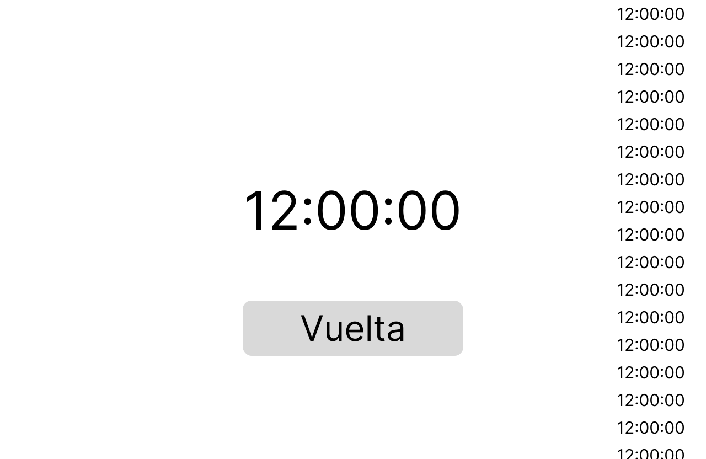

La interfaz constará de 3 componentes;

## Reloj
Muestra el tiempo actual a cada segundo.
Utilizará un useState para mostar valor actual del reloj.
## Botón
Captura el estado actual del reloj y lo guarda en la lista.
## Lista
Representa una lista de capturas del reloj.

